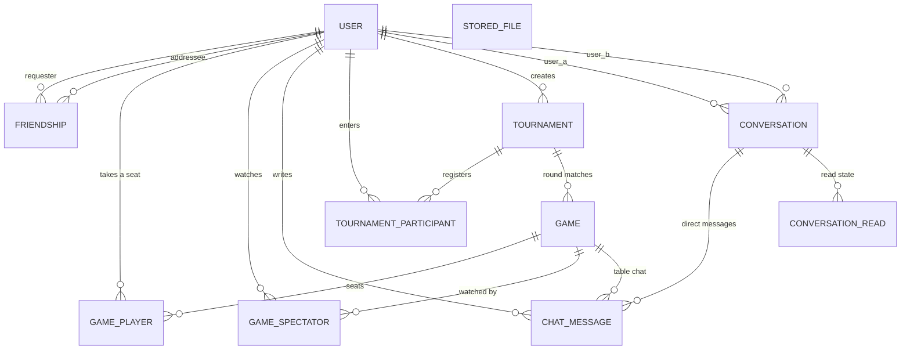

*This project has been created as part of the 42 curriculum by feazeved, alebarbo, dda-fons, wlucas-f.*

<div align="center">

# 🃏 ft_transcendence

**A real-time, multiplayer card-game platform with lobbies, tournaments, spectators, friends and chat.**


[Repository](https://github.com/feazeved/ft_transcendence)

</div>

---

## Table of Contents

1. [Description](#1-description)
2. [Instructions](#2-instructions)
3. [Team Information](#3-team-information)
4. [Project Management](#4-project-management)
5. [Technical Stack](#5-technical-stack)
6. [Database Schema](#6-database-schema)
7. [Features List](#7-features-list)
8. [Modules](#8-modules)
9. [Individual Contributions](#9-individual-contributions)
10. [Mandatory Requirements Checklist](#10-mandatory-requirements-checklist)
11. [Resources](#11-resources)

---

## 1. Description

**ft_transcendence** is the final project of the 42 Common Core. Our team built a full-stack web application: a **real-time multiplayer UNO-style card game platform** where users can create accounts, befriend other players, chat, open game rooms, play with up to **10 players**, spectate live matches and compete in tournaments.

### Goal

Deliver a production-style web application that combines a rich single-page frontend, a robust real-time backend and a reliable relational data model, while practising team work (roles, code reviews, pull requests, shared ownership).

### Key features

- **Complete card game** with a standalone, unit-tested rules engine and configurable **house rules** (stacking +2/+4, jump-in, seven-swap, zero-swap, draw-until-playable, turn timer).
- **Remote real-time play** over WebSockets, with reconnection handling and expiry of disconnected players.
- **Up to 10 players per table**, with seat selection and fair turn handling.
- **Spectator mode** with live spectator counter and per-room spectator permission.
- **Tournament system**, **leaderboard** and **live profile stats** (wins, losses, games played).
- **Chat**: direct messages, table chat, chat dock, game invitations, typing indicators, read receipts, user blocking.
- **Friends & presence**: friend requests pushed live over a presence socket, online status, badge counter for pending requests.
- **Secure authentication**: email + password (Argon2 hashing, live password-rule feedback) and **OAuth 2.0 with 42 and Google**.
- **Custom design system**: theme tokens and reusable UI components built with Tailwind CSS.
- **One-command deployment** with Docker Compose, Nginx reverse proxy and HTTPS.

---


## 2. Instructions

### Prerequisites

| Requirement | Version / Notes |
|---|---|
| Docker Engine | 24+ |
| Docker Compose | v2 (`docker compose`) |
| GNU Make | any recent version (the `Makefile` wraps every Docker Compose command) |
| Google Chrome | latest stable (target browser) |
| OpenSSL | used by `docker/nginx/gen-certs.sh` to generate the local HTTPS certificate |
| OAuth credentials | a 42 API application and a Google OAuth client (for social login) |

### Step-by-step

```bash
# 1. Clone the repository
git clone https://github.com/feazeved/ft_transcendence.git
cd ft_transcendence

# 2. Create your environment file from the template
cp .env.example .env
#    then edit .env and fill in:
#      - DJANGO_SECRET_KEY
#      - POSTGRES_USER / POSTGRES_PASSWORD / POSTGRES_DB, and make sure the
#        user, password and database inside DATABASE_URL match them
#      - allowed hosts / FRONTEND_URL, Redis host
#      - 42 and Google OAuth client id / secret
#      - e-mail settings (used for e-mail confirmation and password-reset e-mails)

# 3. Build and start everything with a single command
make            # = make up = docker compose up --build -d
```

`make up` first runs `check-env`, which stops with an explanatory message if `.env` is missing. When the containers are up, open **https://localhost** in Google Chrome. The HTTPS certificate is generated automatically by `docker/nginx/gen-certs.sh` on the first start, so the browser asks you to accept it the first time.

### Makefile reference

| Command | What it does |
|---|---|
| `make` / `make up` | Check `.env`, then build and start the whole stack in the background |
| `make down` | Stop and remove the containers |
| `make re` | `down` then `up` |
| `make build` | Rebuild all images without cache |
| `make logs` / `make ps` | Follow logs / list running services |
| `make fclean` | Remove containers, **volumes**, images and orphans (full clean) |
| `make reset-db` | Drop the volumes (including the database) and start again from scratch |
| `make migrate` / `make makemigrations` | Apply / create Django migrations in the `backend` container |
| `make check-drift` | Report any model column missing from the database (detects an already-applied migration that was edited afterwards — see `docs/adr/0003-applied-migrations-are-never-edited.md`) |
| `make superuser` | Create a Django admin user |
| `make backend-shell` / `frontend-shell` / `db-shell` | Open a shell in the backend / frontend container, or `psql` in the database |
| `make test-engine` | Run the game-engine unit tests (`pytest`) |
| `make test-api` | Run the Django API / consumer tests (`manage.py test game_api`) |
| `make backend-tests` | Run both test suites (`test-engine` + `test-api`) |

> Production deployment (Render / Vercel) uses `docker-compose.prod.yml` and a production Nginx configuration on top of the same images.

> The `.env` file is ignored by Git. Never commit credentials — only `.env.example` is versioned.

---

## 3. Team Information

| Member | 42 login · Git identities | Assigned role(s) | Responsibilities |
|---|---|---|---|
| **Daniel Fonseca** | `dda-fons` · `Danielfonsecaa` | **Product Owner** + **Lead Frontend Developer** | Defined the product vision and UX direction (the "hub" home page, lobby, table, profile), owned the visual redesign and design system, prioritised features, validated finished work, integrated the `dev`/`redesign` branches, prepared the deployment (Render / Vercel, production Nginx). |
| **Felipe Suassuna** | `feazeved` · `Felipe Azevedo Soares Suassuna` | **Technical Lead** (DevOps) + **Developer** (infrastructure & frontend) | Owns the technical architecture and infrastructure: bootstrapped the repository, built the Docker / Nginx / Makefile stack and the HTTPS setup, prepared the deployment, reviewed and merged pull requests; also delivered the home, friends and leaderboard pages and the block-user feature. |
| **Alex Barbosa** | `alebarbo` · `magusk89`, `Magusk Lutus` | **Project Manager / Scrum Master** + **Backend Developer** | Coordinated the team's work (issues, branches, pull requests), tracked progress and reviewed critical backend changes; developed the backend: Django project, game engine and its rules modifiers, authentication, presence, friends/profile API, chat, leaderboard, tournaments and the test-suite. |
| **Wallace Gonçalves** | `wlucas-f` · `Wallace` | **Backend Developer** (data model & concurrency) | Designed and documented the database ERD, implemented room codes and names, the spectator model/endpoints, and hardened the game WebSocket consumer and viewsets (transactions, row-locking, `on_commit`). |

> Since we are a four-person team, some members hold several roles, as allowed by the subject. All members developed code, participated in code reviews, tested and documented their own work.

---

## 4. Project Management

### How we organised the work

- **Issue-driven workflow.** Every substantial piece of work started as a GitHub issue; branches were named after the issue (`1-back-end-scaffolding`, `2-dockers-initial-structure`, `14-home-page`, `30-authentication`, `67-lobby-over-the-socket`, `68-fix-turn-timer`, …).
- **Branching model.** `dev` is the integration branch. Feature branches are merged into `dev` through **pull requests** (PR #2 → #74). Long-running branches (`front_lobby`, `redesign`) regularly merged `dev` back into themselves to avoid collisions before the final merge.
- **Code reviews.** Every PR was merged by a member other than (or in addition to) its author; the Project Manager reviewed critical backend changes (game engine, consumers, migrations).
- **Conventional commits.** Commit messages follow `feat:`, `fix:`, `refactor:`, `chore:` prefixes with a short description, so the history is readable and every member's work is traceable.
- **Work split.** Backend/game logic (Alex, Wallace), infrastructure (Felipe), frontend & product (Daniel, Felipe); cross-cutting features (lobby over sockets, turn timer) were paired between backend and frontend members.
- **Meetings.** We met **whenever the work required it** (planning a feature, unblocking a merge, agreeing on an API contract) rather than on a fixed schedule.
- **Pair programming.** A few pair-programming sessions were held on cross-cutting or tricky parts, so that more than one member understands each of them.

### Tools

| Purpose | Tool |
|---|---|
| Task tracking | GitHub Issues + Pull Requests |
| Version control | Git / GitHub (feature branches, `dev` integration branch) |
| Documentation | `README.md`, database ERD image, docs added alongside the redesign |
| Communication | **Discord** (team discussion and calls), **WhatsApp** (quick day-to-day coordination), GitHub issue and pull-request discussions (technical review) |

---

## 5. Technical Stack

| Layer | Technology | Justification |
|---|---|---|
| **Frontend** | **React** (SPA) | Component model fits a UI made of reusable pieces (cards, seats, modals, chat dock) and makes it easy to derive UI state from WebSocket messages. Counts as a framework for the *Web – Framework* module. |
| **Styling** | **Tailwind CSS** + custom theme tokens | Utility-first CSS keeps styling consistent, is fast to iterate on and lets us build our own design system (palette, typography, spacing, ≥ 10 reusable components) without a heavy component library. |
| **Frontend tooling** | **Vite**, **Vitest**, oxlint, React Router | Vite gives fast builds and hot reload; Vitest covers the pure helpers (cards, chat, friends, tournaments, password rules, API contracts); oxlint keeps the code base consistent; React Router handles client-side routing with authenticated routes. |
| **Backend** | **Django** + **Django REST Framework** | Batteries-included framework: ORM, migrations, auth, admin, validation and serializers out of the box; DRF viewsets/serializers give a clean, documented REST layer and enforce server-side validation. |
| **Real-time** | **Django Channels** (ASGI consumers) | Native WebSocket support inside the same Django project, sharing models, auth and business logic. Separate consumers for **game**, **chat** and **presence**. |
| **Channel layer / cache** | **Redis** | Pub/sub backbone for broadcasting game, chat and presence events across workers with low latency. |
| **Authentication** | **django-allauth** + **dj-rest-auth** (custom adapters) | Proven implementation of e-mail/password auth, optional e-mail confirmation, password reset and OAuth 2.0 (42 and Google), exposed as a REST API. Sessions are cookie-based with CSRF protection (`SESSION_COOKIE_SECURE` / `CSRF_COOKIE_SECURE` on in production), and custom adapters import the provider's profile picture. |
| **Password hashing** | **Argon2id** (`game_api/hashers.py`) | Memory-hard, salted hashing recommended by OWASP, tuned to OWASP's minimum cost so a small server can afford it. We migrated from PBKDF2-SHA256 after measuring slow logins; legacy PBKDF2 hashes are transparently upgraded to Argon2 on their owner's next login. Django's password validators (length, common, numeric, similarity) run server-side. |
| **Database** | **PostgreSQL** | Reliable relational store with strong integrity guarantees, transactions and **row-level locking** (`select_for_update`), which we rely on to avoid race conditions when several players join, play or leave concurrently. |
| **Game logic** | Pure-Python **`game_engine`** package | Rules (cards, deck, state, modifiers) are isolated from Django, easy to unit-test (22+ engine tests) and serialisable to/from JSON for persistence and WebSocket payloads. |
| **Reverse proxy / HTTPS** | **Nginx** | TLS termination (all external traffic is HTTPS), WebSocket proxying, static/media serving and redirection of unknown URIs to a 404 page in production. |
| **Containerisation** | **Docker + Docker Compose** | Whole stack (frontend, backend, DB, Redis, Nginx) starts with a single command and behaves identically on every machine. |
| **Testing** | **pytest** + Django test runner | `pytest` for the pure-Python game engine; Django's test runner for REST endpoints, consumers (with `on_commit` draining), chat, tournaments and authentication. Both run through `make backend-tests`. |
| **Hosting (demo)** | Render (backend) / Vercel (frontend) | Free-tier friendly hosting for public demos, with a `/healthz` endpoint and a production Compose overlay. |

### Major technical choices

1. **Game engine decoupled from the web layer** — the rules can be tested and reasoned about without any I/O, and the same state object is used for persistence and for the WebSocket protocol.
2. **Server-authoritative game state** — clients only send *intents* (play card, draw, jump in…); the server validates, applies them and sends each player a **personalised state** (hidden hands) plus the room's house rules.
3. **Transactional consistency** — game mutations are wrapped in transactions with row locking, and broadcasts happen in `transaction.on_commit` so clients never see uncommitted state.
4. **Presence over a dedicated socket** — friend requests, friendship changes and online status are pushed live instead of polled.

---

## 6. Database Schema

The schema is relational (PostgreSQL), managed through Django migrations, and defined in
`backend/game_api/models.py`. Integrity is enforced by the **database**, not by application code:
seats are unique per game, a pair of users can only ever have one conversation, and a chat message
must belong to exactly one place.



### Tables

| Table | Key fields | Relations and constraints |
|---|---|---|
| **User** (extends `AbstractUser`) | `id` (PK), `public_id` (UUID, unique), `username`, `email` (unique), `password` (**Argon2**), `display_name`, `avatar`, `oauth_provider`, `oauth_id`, `language`, `theme`, `accepted_privacy_at`, `last_seen_at`, `deleted_at` | `public_id` is the only identifier the API exposes; the integer PK never leaves the server. `is_online` is a **derived property** (a live presence connection, tracked in Redis by `PresenceConsumer`), not a column. |
| **StoredFile** | `id` (PK), `name` (unique), `content` (binary), `content_type`, `size`, `uploaded_at` | Uploaded avatars are stored in the database through a custom Django storage (`game_api.storage.DatabaseStorage`), so they survive redeploys on hosts without persistent disks (`docs/adr/0005-uploaded-files-live-in-the-database.md`). No foreign keys: the `User.avatar` path refers to `name`. |
| **Friendship** | `id` (PK), `requester` (FK User), `addressee` (FK User), `status`, `created_at` | `status` ∈ `pending` / `accepted` / `declined` / **`blocked`**. Unique on (`requester`, `addressee`). **Blocking is a friendship status, not a separate table** — one row describes the whole relationship between two people. |
| **Game** (a room) | `id` (PK), `public_id` (UUID), `join_code` (unique, generated), `name`, `host` (FK User), `status`, `mode`, `allow_spectators`, `max_seats` (2–10), `starting_hand_size`, `turn_timer_seconds`, `turn_started_at`, five house-rule booleans (`draw_stacking`, `jump_in`, `draw_until_playable`, `seven_swap`, `zero_swap`), `extra_rules` (JSON), `state` (JSON), `winner` (FK User), `tournament` (FK, nullable), `tournament_round`, `created_at`, `finished_at` | `status` ∈ `pending` / `in_progress` / `finished` / `cancelled`. `state` holds the serialised engine state. A row with a `tournament` is a bracket match. |
| **GamePlayer** | `id` (PK), `game` (FK), `user` (FK, nullable), `kind` (`human`/`ai`), `ai_level`, `seat`, `display_name`, `is_connected`, `declared_last_card`, `finish_position` | **Unique on (`game`, `seat`)** — the database refuses two players in one chair. `finish_position` is written when a game ends and is what tournament advancement and match history read. `user` is nullable so a deleted account leaves its games intact. |
| **GameSpectator** | `id` (PK), `game` (FK), `user` (FK), `joined_at` | Watching without a seat; drives the live spectator count. |
| **Tournament** | `id` (PK), `public_id` (UUID), `join_code` (unique), `name`, `created_by` (FK User), `status`, `max_participants`, `winner` (FK User), `format` (`knockout`/`bestof`), `players_per_table` (4–7), `advance_per_table` (1–3), `starting_hand_size`, `turn_timer_seconds`, `final_best_of_3`, `matches_per_round`, `matches_in_final`, the five house rules, `created_at`, `finished_at` | The configuration is **flat on the model, not a JSON blob**, so the structure function and the settings panel read it directly. Every `Game` the tournament creates inherits these settings. |
| **TournamentParticipant** | **composite PK (`tournament_id`, `user_id`)**, `seed`, `final_position` | `final_position` is written from the final table's finishing order and is what the podium displays. |
| **Conversation** | `id` (PK), `user_a` (FK), `user_b` (FK), `created_at` | Unique on (`user_a`, `user_b`) **plus a check constraint `user_a < user_b`**. Storing the pair in a canonical order means two people can only ever have one conversation, whichever of them starts it — enforced by the database rather than by remembering to check. |
| **ConversationRead** | `id` (PK), `conversation` (FK), `user` (FK), `last_read_at` | Unique on (`conversation`, `user`). Drives unread counts and read receipts. |
| **ChatMessage** | `id` (PK), `conversation` (FK, nullable), `game` (FK, nullable), `user` (FK, nullable), `message_type` (`text`/`game_invite`), `body`, `invited_game` (FK, nullable), `created_at` | **A check constraint enforces exactly one of `conversation` or `game`** — a message is either a direct message or table chat, never both and never neither. The same table serves both, so history, blocking and invitations work identically in each. |

> `User.totp_secret_encrypted` and `GamePlayer.kind` / `ai_level` are **reserved columns** for features we did not build (two-factor authentication and AI players); no module claimed here depends on them.

> Statistics, match history and the leaderboard are **derived** from `GamePlayer` joined to `Game`
> rather than stored as counters, so they can never drift out of step with the games actually
> played. The leaderboard lists every active account, including those with no games yet.

---

## 7. Features List

| # | Feature | Description | Implemented by |
|---|---|---|---|
| 1 | **Infrastructure & one-command deploy** | Unified Dockerfiles, `docker-compose` (Nginx, Redis, DB, backend, frontend), entrypoint scripts, Makefile, HTTPS certificate generation, production overlay, `/healthz` | Felipe, Daniel |
| 2 | **Game rules engine** | Cards, deck, state, turn/direction logic, effects, win conditions, JSON (de)serialisation, up to 10 players, 22+ unit tests | Alex |
| 3 | **House rules / modifiers** | Stackable +2/+4, jump-in, seven-swap, zero-swap, draw-until-playable, configurable per room and sent with every `game_state` | Alex, Felipe, Daniel |
| 4 | **Game WebSocket consumer** | Real-time game state updates, personalised state per player, chat handling, spectators, disconnect/expiry logic, transaction-safe broadcasts | Alex, Wallace, Daniel |
| 5 | **Rooms & lobby** | Create-room modal, room list, room name + join code, seat selection (lowest free seat), lobby → table flow, room closes when the host leaves | Daniel, Wallace, Felipe |
| 6 | **Game table UI** | Table, cards, derived notices, turn timer, table chat | Daniel |
| 7 | **Turn timer** | Real server-side timer (`turn_started_at`), restarted after a win (tournaments) | Daniel, Felipe, Wallace |
| 8 | **Spectator mode** | Watch live games, spectator counter, `allow_spectators`, spectator endpoints | Alex, Wallace |
| 9 | **Tournaments** | Models, serializers, viewset, registration & bracket logic, game integration, frontend tournament screens | Alex, Daniel |
| 10 | **Authentication** | E-mail/password sign-up & login, optional e-mail confirmation, forgot / reset-password and confirm-e-mail pages, Argon2 hashing, server-side password validators, live password-rule feedback | Alex, Daniel |
| 11 | **OAuth 2.0** | 42 and Google login, provider avatar import, redirect preserved after OAuth | Alex, Daniel |
| 12 | **User profile** | Editable profile, avatar upload (cropped, size-limited, default avatar), real password change, live stats | Daniel, Alex |
| 13 | **Friends system** | Send/accept/remove requests, friends list, online status, live push over the presence socket, pending-request badge | Alex, Felipe, Daniel |
| 14 | **Presence** | `is_online` / `last_seen`, `PresenceConsumer` | Alex |
| 15 | **Chat** | Direct conversations (one per pair of users), persisted history, chat dock, table chat, game invitations, typing indicators, unread counts / read receipts | Alex, Daniel, Felipe |
| 16 | **Block users** | Block button; blocking is stored as a `blocked` status on the friendship row | Felipe |
| 17 | **Leaderboard** | Ranking API + page (includes users with 0 games) | Alex, Felipe, Daniel |
| 18 | **Game statistics** | Wins / losses / games played / win rate on the profile; leaderboard orderings; stats and match-history API endpoints (`/api/users/<id>/stats/`, `/matches/`) | Alex, Felipe, Daniel |
| 19 | **Design system** | Theme tokens, layout, reusable UI components, home "hub" (rooms, ranking, rules) | Daniel, Felipe |
| 20 | **Legal & error pages** | Privacy Policy, Terms of Service, 404, footer links | Daniel |
| 21 | **Automated tests** | Engine, API, consumers, chat, tournaments, auth, frontend pure functions | Alex, Wallace, Daniel |

---

## 8. Modules

### Point calculation

| Category | Count | Points | Subtotal |
|---|:---:|:---:|:---:|
| **Mandatory** modules | 7 | (6 * 2) + (2 * 1) | **14** |
| **Bonus** modules | 8 | (1 * 2) + (7 * 1) | **9** |
| **Total claimed** | 15 | – | **23** |

The mandatory threshold is **14 points**. We claim **23** (14 mandatory + 9 bonus). The bonus is capped at 5 points above 14, so the extra modules are also a safety margin in case some of them are not validated during evaluation.

### Mandatory modules (14 pts)

| # | Module | Pts | Why we chose it | How it was implemented | Who |
|---|---|:---:|---|---|---|
| 1 | **Web – Framework (frontend + backend)** | 2 | Structured architecture and conventions are essential for a 4-person team working in parallel. | **React** SPA + **Django / Django REST Framework** backend. | All |
| 2 | **Web – Real-time features (WebSockets)** | 2 | A card game, chat and presence are meaningless without instant updates. | **Django Channels** consumers (`GameConsumer`, `ChatConsumer`, `PresenceConsumer`) with a Redis channel layer; graceful connect/disconnect handling and efficient group broadcasting. | Alex, Wallace, Daniel |
| 3 | **User Management – Standard user management & authentication** | 2 | Accounts are the base for friends, stats and rankings. | Profile editing, avatar upload with default avatar, friends with online status, profile pages, secure e-mail/password auth (Argon2). | Alex, Daniel, Felipe |
| 4 | **Gaming – Complete web-based game** | 2 | Core product of the platform. | Server-authoritative card game with a pure-Python rules engine, clear win conditions, live matches in the browser. | Alex, Daniel, Felipe |
| 5 | **Gaming – Multiplayer (3+ players)** | 2 | Card games shine with several players. | Engine and lobby support up to **10 players**, seat management, direction/reverse handling, per-player hidden hands, synchronised state for every client. | Alex, Wallace, Daniel |
| 6 | **Web – User interaction (basic chat + profile + friends)** | 2 | Social features keep players engaged. | Direct chat with persisted conversations, profile system, friends system (add/remove/list). | Alex, Felipe, Daniel |
| 7 | **Web – ORM** | 1 | Avoids raw SQL, guarantees migrations and schema consistency. | **Django ORM** models and migrations (`0001_initial` …). | Daniel, Alex, Wallace |
| 8 | **User Management – Remote authentication (OAuth 2.0)** | 1 | Lower friction sign-up for 42 students and general users. | **42** and **Google** providers through django-allauth with custom adapters (avatar import, redirect preservation). | Alex, Daniel |

### Bonus modules (9 pts)

| # | Module | Pts | Why we chose it | How it was implemented | Who |
|---|---|:---:|---|---|---|
| 9 | **Web – Custom design system (≥ 10 reusable components)** | 1 | Consistent look and faster UI development across pages. | Theme tokens (palette, typography, spacing) in `frontend/src/index.css` and 12 reusable UI components in `frontend/src/components/ui` (Button, ButtonLink, Dialog, FormField, PasswordInput, Panel, PageHeader, Avatar, Message, Stat, SwitchRow, BrandMark) plus icon sets, all built with Tailwind CSS v4 and shared by every page. | Daniel, Felipe |
| 10 | **Gaming – Spectator mode** | 1 | Lets friends watch live games and makes matches social. | `GameSpectator` model, spectator endpoints, spectator-aware consumer, live spectator counter, per-room `allow_spectators`. | Alex, Wallace |
| 11 | **Gaming – Advanced chat features** | 1 | Improves safety and integration of chat with the rest of the platform. | Blocking (a `blocked` friendship status), persisted chat history, game invitations sent as chat messages (`message_type = game_invite`) with a join button, typing indicators, unread counts / read receipts (`ConversationRead`), chat dock and table chat. | Alex, Felipe, Daniel |
| 12 | **Gaming – Tournament system** | 1 | Adds a competitive mode on top of single games. | Tournament models with a flat configuration (knockout / best-of formats, players per table, advancement), serializers and viewset, registration, bracket / matchmaking, games inheriting tournament settings, tournament screens. | Alex, Daniel |
| 13 | **Gaming – Remote players** | 2 | Players must be able to compete from different computers. | Game state is synchronised over WebSockets; latency-tolerant intent/state protocol; reconnection and expiry of disconnected players; turn timer. | Alex, Wallace, Daniel |
| 14 | **User Management – Game statistics and match history** | 1 | Players want to see how they perform, and the ranking gives every game a competitive edge. | Statistics are **derived** from `GamePlayer` joined to `Game` (never stored as counters): wins, losses, games played and win rate, served by `/api/users/<id>/stats/` and shown in the profile's Record panel. The **leaderboard** (`/api/leaderboard/`) ranks every active account, sortable by wins, win rate or games played, with pagination. A match-history endpoint (`/api/users/<id>/matches/`) lists a user's finished games with their results and opponents. | Alex, Felipe, Daniel |
| 15 | **Gaming – Game customization options** | 1 | Different groups like different games: rooms and tournaments can be tuned instead of forcing one rule set. | Five optional **game rules** (draw stacking, jump-in, draw-until-playable, seven-swap, zero-swap) implemented as engine modifiers and switched on per room or per tournament, plus customizable settings (max players 2–10, starting hand size, turn timer, spectators allowed). The classic rules are the default. Tournaments pass their settings to every game they create, and the active rules are displayed as chips in the lobby and on the tournament pages. | Alex, Felipe, Daniel |
| 16 | **Accessibility & Internationalization – Support for additional browsers** | 1 | Not every player (or evaluator) uses Chrome. | Full compatibility with **Mozilla Firefox, Brave** and **Safari**, in addition to Google Chrome: every feature (authentication, lobby, game table, WebSockets, chat, tournaments) was tested in each browser. Limitations are listed in [Browser support](#browser-support). | All |

### Browser support

| Browser | Status |
|---|---|
| Google Chrome (latest stable) | Primary target |
| Mozilla Firefox | Supported |
| Brave | Supported |
| Safari | Supported |

**Known limitations.** The interface is built with Tailwind CSS v4, which targets modern browsers (Chrome 111+, Firefox 128+, Safari 16.4+); Brave follows the Chromium version it is built on. Older versions of these browsers are not supported.

---

## 9. Individual Contributions

### 👤 Daniel Fonseca (`dda-fons`) — *Product Owner · Lead Frontend*

**Contributions**
- Built the frontend foundation: navbar, footer, modals, login/register/profile pages, **Privacy Policy**, **Terms of Service** and **404** pages.
- Led the **big redesign**: theme, UI components, new layout, home as a hub (rooms, ranking, rules), rebuilt friends, leaderboard, profile, lobby, game table and tournament screens.
- Implemented the **chat dock** and **table chat**, live friend-request badge, live password-rule feedback.
- Connected **OAuth (42/Google)** on the frontend, provider avatar handling, avatar upload with cropping.
- Created the initial database models/migration and the database picture used for documentation.
- Backend integration: presence-socket push for friendships, real turn timer, house rules in every `game_state`, resilience when Redis is down.
- Deployment preparation: production Compose overlay, Nginx production config, `/healthz`, Vercel/Render setup.

**Challenges & solutions**
- *Slow logins* → replaced PBKDF2-SHA256 with **Argon2** and disabled OAuth buttons after the first click to prevent duplicate requests.
- *OAuth first login returned 500 and avatars were not saved* → reworked adapters and settings so the provider picture is stored and static/media URLs are correct.
- *Leftover merge-conflict markers* in `GameTable.jsx` / `Lobby.jsx` → cleaned up and agreed to merge `dev` into long-lived branches more often.

---

### 👤 Felipe Suassuna (`feazeved`) — *Technical Lead (DevOps) · Frontend*

**Contributions**
- Created the repository and structure; wrote **Dockerfiles, entrypoints, Nginx configuration, `gen-certs.sh`, Compose file (Nginx + Redis) and the Makefile**.
- Reviewed and merged most pull requests and owned the technical setup shared by the whole team.
- Frontend: **home page**, **friends page** (components, requests, errors/loading states), **leaderboard page** wired to the backend (including users with 0 games), **block-user** feature.
- Backend fixes: lowest free seat for joining players, `conversation_id` in chat messages, missing-`.env` database bug, turn-timer reset after a winner (for tournaments), first version of the game **modifiers** for multiplayer.

**Challenges & solutions**
- *Getting Docker, Nginx and Redis to run identically for everyone* → unified Dockerfiles, `env_file` support and a documented `.env.example`.
- *Wrong-branch commits and collisions* → merged `dev` into feature branches frequently and standardised issue-based branch names.

---

### 👤 Alex Barbosa (`alebarbo`) — *Project Manager · Backend*

**Contributions**
- Coordinated the team's workflow (issues → branches → PRs), tracked progress and reviewed critical backend changes.
- Scaffolded the Django backend (`core`, `game_api`, `game_engine`), configured Channels, settings and requirements.
- Wrote the whole **game engine** (`cards`, `deck`, `state`, `engine`, `modifiers`) with stacking, jump-in, zero-swap and draw-until-playable modifiers, JSON serialisation and **22+ unit tests**.
- Implemented **authentication** (allauth adapters, optional e-mail confirmation, password-reset endpoints, 42 provider), **presence** (`is_online`, `last_seen`, `PresenceConsumer`), **profile & friendship** API.
- Built `GameViewSet`, `GameConsumer`, **match history**, **leaderboard**, **chat** (conversations, views, `ChatConsumer`), **tournaments** (models, serializers, viewset, consumer integration, tests) and the first **spectator** implementation and turn-timing attribute.
- Added backend test commands to the Makefile and tests for every backend feature.

**Challenges & solutions**
- *Race condition between `jump_in` and stacking modifiers* → introduced a dedicated hook for the jump-in bypass and refactored `play_card` / `jump_in`, with tests for combined rules.
- *Crash in `zero_swap`* → implemented the missing fourth argument in `_run_modifiers` and added tests.
- *Migrations/auth blocked early on* → fixed model imports and `INSTALLED_APPS`, then stabilised with an authentication test-suite.

---

### 👤 Wallace Gonçalves (`wlucas-f`) — *Backend Developer · Data model & concurrency*

**Contributions**
- Authored the **database ERD** and reviewed the data model.
- Added `name`, `join_code` and a **room-code generator** to `Game`, plus serializer fields for rooms and spectators.
- Implemented the **`GameSpectator`** model, spectator endpoints and `GameDetailSerializer` updates.
- Made the game API safe under concurrency: **`GameViewSet` lookup by code/UUID with row-locking**, transaction boundaries, `transaction.on_commit`, persistence of `turn_started_at`.
- Refactored `GameConsumer` (`_resolve`, `_personalized_state`, `_handle_chat`, `game_update`, WebSocket path for room codes/UUIDs) and fixed related tests (`drain_on_commit`).

**Challenges & solutions**
- *Duplicate/inconsistent state under simultaneous actions* → row-level locking and `on_commit` broadcasts so clients only receive committed state.
- *Serializer/model mismatches* (`unique_together` syntax, missing fields causing 500 on `api/games/`) → fixed and covered with tests.

---

## 10. Mandatory Requirements Checklist

| Requirement | Status |
|---|:---:|
| Web app with frontend, backend and database | ✅ |
| Git with clear commits from **all** team members | ✅ |
| Containerised, runs with a **single command** | ✅ |
| Compatible with the latest stable **Google Chrome** | ✅ |
| No JavaScript warnings/errors in the console | ✅ |
| Accessible **Privacy Policy** and **Terms of Service** pages (footer links, real content) | ✅ |
| **Multi-user** support (concurrent sessions, real-time updates, no race conditions) | ✅ |
| Responsive frontend + CSS framework (Tailwind CSS) | ✅ |
| Credentials in a Git-ignored `.env` + provided `.env.example` | ✅ |
| Clear database schema with well-defined relations | ✅ |
| Secure sign-up/login (e-mail + password, hashed and salted with Argon2) | ✅ |
| Form/input validation on **both** frontend and backend | ✅ |
| **HTTPS** for every connection to the backend | ✅ |

---

## 11. Resources

### References

- [Django documentation](https://docs.djangoproject.com/)
- [Django REST Framework](https://www.django-rest-framework.org/)
- [Django Channels](https://channels.readthedocs.io/)
- [django-allauth](https://docs.allauth.org/)
- [React documentation](https://react.dev/)
- [Tailwind CSS documentation](https://tailwindcss.com/docs)
- [PostgreSQL documentation](https://www.postgresql.org/docs/) (transactions and row-level locking)
- [Redis documentation](https://redis.io/docs/)
- [Docker & Docker Compose documentation](https://docs.docker.com/)
- [Nginx documentation](https://nginx.org/en/docs/) (reverse proxy, WebSocket proxying, TLS)
- [42 API documentation](https://api.intra.42.fr/apidoc) and [Google OAuth 2.0](https://developers.google.com/identity/protocols/oauth2)
- [OWASP Password Storage Cheat Sheet](https://cheatsheetseries.owasp.org/cheatsheets/Password_Storage_Cheat_Sheet.html) (Argon2)
- [pytest documentation](https://docs.pytest.org/)
- [Conventional Commits](https://www.conventionalcommits.org/)

### How AI was used

In line with the 42 AI guidelines, AI tools were used as an **assistant**, never as a substitute for understanding: each member must be able to explain and take responsibility for any AI-assisted code they committed.

| Task | Part of the project | Notes |
|---|---|---|
| Drafting the **42 OAuth provider/adapter** | Backend authentication | Initial draft produced with an AI agent, then manually verified and tested by the team (noted in the commit history). |
| Producing **unit tests** | Backend (game engine, API, consumers, chat, tournaments, authentication) | AI helped write the backend test suites. |
| **Website design** with Claude Design | Frontend (visual design and redesign of the pages and components) | Claude Design was used to design the look of the website. |
| Helping to **fix WebSocket problems** | Real-time layer (game, chat and presence consumers) | AI assisted with debugging connection, broadcasting and consistency issues. |
| Help with the **chat** | Chat feature (backend consumer and frontend dock) | AI assisted while building and debugging the chat. |
| **README formatting** | Documentation (`README.md`) | AI was used to structure and format this document. |

---

<div align="center">

Made with ☕ and a lot of `+4` cards by the ft_transcendence team.

</div>
